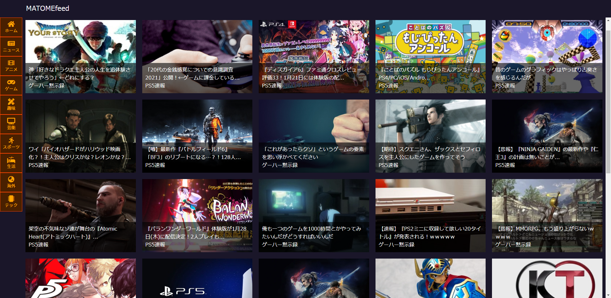

## MATOMEfeed（制作途中）
URL：<a href="https://matomefeed.com/" target="_blank">matomefeed.com</a>

  数多く存在する5ch・Twitterまとめサイトを集約し、画像付きのリッチなUIで配信します。
  記事はカテゴリーとタグで細かく分類し、好きな記事を簡単に探すことができます。
  アカウント登録することで、オリジナルのフィルターを作って記事を絞り込んだり、
  お気に入りのまとめサイトを登録できます。

当Webアプリはプログラミングの学習も兼ねて制作を進めました。

### 使用技術
・インフラ：VPS（CentOS7.8） 
・Webサーバー：Nginx 
・主要言語：PHP、JavaScript 
・フレームワーク：Laravel、Vue.js

### キャプチャー
<strong>記事のローディング</strong>

 
<strong>記事の一覧</strong>

